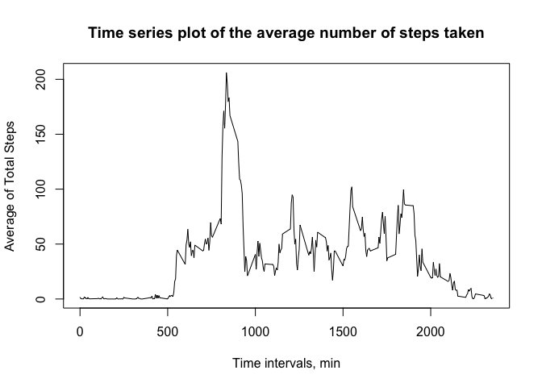

PA1\_template
================

``` r
library(plyr)
library(reshape2)
library(lattice)
```

### 11 February, 2018

Code for reading in the dataset and/or processing the data
----------------------------------------------------------

``` r
dt <- read.csv("activity.csv",colClasses=c("numeric","Date","numeric"))
```

Histogram of the total number of steps taken each day
-----------------------------------------------------

``` r
stepsPerDay <- tapply(dt$steps, dt$date, sum, na.rm=TRUE)

hist(stepsPerDay, col=topo.colors(5),
                  xlab="Total Steps Per Day", 
                  main="Total Steps Per Day")
```


Mean and median number of steps taken each day
----------------------------------------------

``` r
mean(stepsPerDay)
```

    ## [1] 9354.23

``` r
median(stepsPerDay)
```

    ## [1] 10395

Time series plot of the average number of steps taken
-----------------------------------------------------

``` r
meanInts <- tapply(dt$steps, dt$interval, mean, na.rm=TRUE)

plot(row.names(meanInts),
     meanInts,
     type="l",
     xlab="Time intervals, min",
     ylab="Average of Total Steps",
     main="Time series plot of the average number of steps taken")
```



The 5-minute interval that, on average, contains the maximum number of steps
----------------------------------------------------------------------------

``` r
meanInts[match(max(meanInts), meanInts)]
```

    ##      835 
    ## 206.1698

Code to describe and show a strategy for imputing missing data
--------------------------------------------------------------

``` r
dtNa <- dt[is.na(dt),]
dtComplete <- dt[complete.cases(dt),]
dtNa$steps <- as.numeric(meanInts)
dtNew <- rbind(dtNa, dtComplete)
dtNew <- dtNew[order(dtNew[,2], dtNew[,3]),]
```

Histogram of the total number of steps taken each day after missing values are imputed
--------------------------------------------------------------------------------------

``` r
stepsPerDayNew <- tapply(dtNew$steps, dtNew$date, sum)
hist(stepsPerDayNew, col='blue',
                      xlab="Total Steps Per Day",
                      main="Total Spets Per day without NA")
```


Panel plot comparing the average number of steps taken per 5-minute interval across weekdays and weekends
---------------------------------------------------------------------------------------------------------

``` r
days <- weekdays(dtNew[,2])
dtNew <- cbind(dtNew, days)
dtNew$weekpart <- 0
dtNew$weekpart[with(dtNew, days!="Sunday" && days!="Saturday")] <- "weekday"
dtNew$weekpart[with(dtNew, days=="Sunday" | days=="Saturday")] <- "weekend"


mint <- tapply(dtNew$steps,list(dtNew$interval, dtNew$weekpart), mean)
mint <- melt(mint)
colnames(mint) <- c("interval","day","steps")
xyplot(mint$steps ~ mint$interval | mint$day, layout=c(1,2),
       type="l",
       main="Steps per Day (weekday and weekend)",
       xlab="Time intervals, min",ylab="Steps per Day")
```


